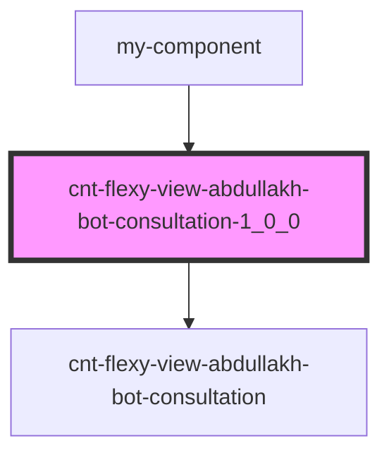

# cnt-flexy-view-abdullakh-bot-consultation-1_0_0

<!-- Auto Generated Below -->

## Properties

| Property  | Attribute | Description                    | Type  | Default     |
| --------- | --------- | ------------------------------ | ----- | ----------- |
| `payload` | `payload` | данные компонента Consultation | `any` | `undefined` |

## Events

| Event      | Description                 | Type               |
| ---------- | --------------------------- | ------------------ |
| `openForm` | Вызов модального окна формы | `CustomEvent<any>` |

## Dependencies

### Used by

 - [my-component](../my-component)

### Depends on

- [cnt-flexy-view-abdullakh-bot-consultation](./res/view/cnt-flexy-view-abdullakh-bot-consultation)

### Graph

----------------------------------------------

*Built with [StencilJS](https://stenciljs.com/)*
