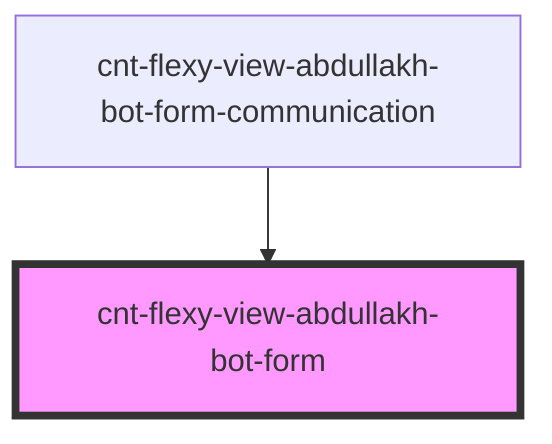

# s-abdullakh-form

<!-- Auto Generated Below -->

## Properties

| Property | Attribute | Description                           | Type  | Default     |
| -------- | --------- | ------------------------------------- | ----- | ----------- |
| `arr`    | `arr`     | данные из массива для компонента Form | `any` | `undefined` |

## Dependencies

### Used by

 - [cnt-flexy-view-abdullakh-bot-form-communication](../../..)

### Graph

----------------------------------------------

*Built with [StencilJS](https://stenciljs.com/)*
