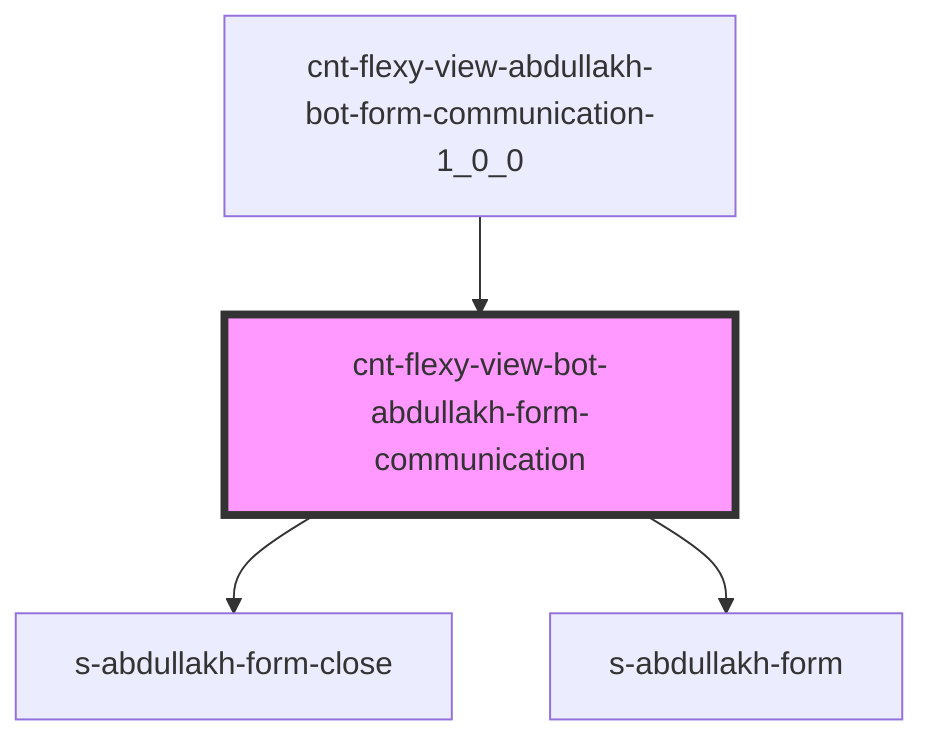

# s-abdullakh-form-communication

<!-- Auto Generated Below -->

## Properties

| Property  | Attribute | Description                         | Type  | Default     |
| --------- | --------- | ----------------------------------- | ----- | ----------- |
| `payload` | `payload` | данные компонента FormCommunication | `any` | `undefined` |

## Events

| Event       | Description                    | Type               |
| ----------- | ------------------------------ | ------------------ |
| `closeForm` | Закрытие модального окна формы | `CustomEvent<any>` |

## Dependencies

### Used by

 - [cnt-flexy-view-abdullakh-bot-form-communication-1_0_0](../../..)

### Depends on

- [s-abdullakh-form-close](./res/view/s-abdullakh-form-close)
- [s-abdullakh-form](./res/view/s-abdullakh-form-form)

### Graph

----------------------------------------------

*Built with [StencilJS](https://stenciljs.com/)*
