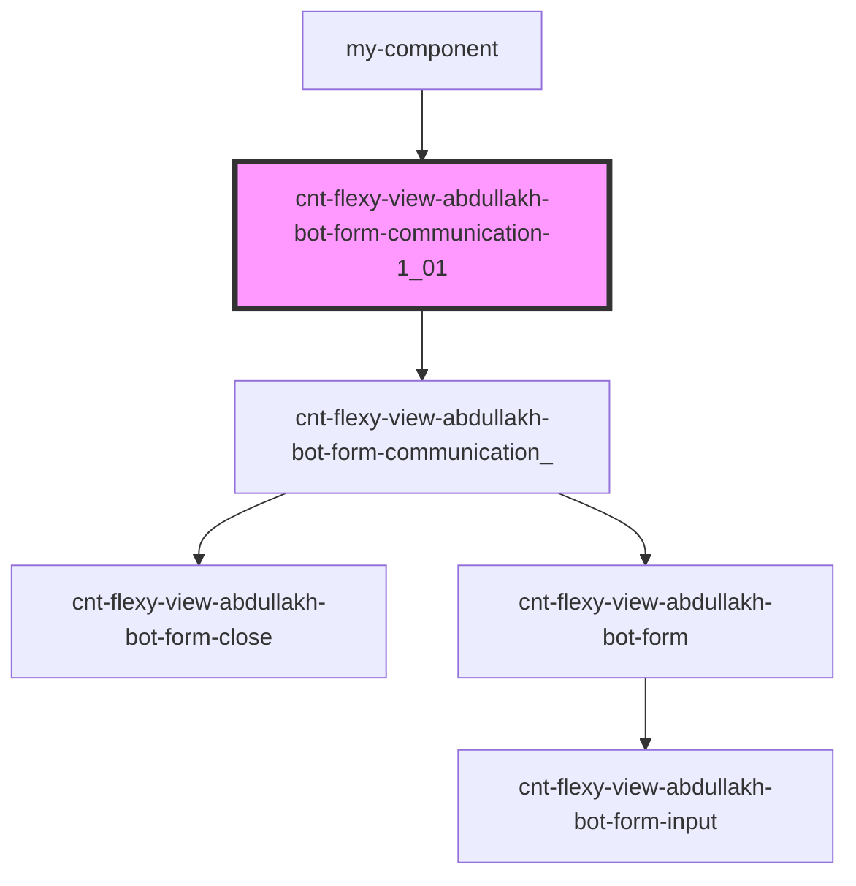

# cnt-flexy-view-abdullakh-bot-form-communication-1_0_0

<!-- Auto Generated Below -->

## Properties

| Property       | Attribute        | Description                         | Type     | Default     |
| -------------- | ---------------- | ----------------------------------- | -------- | ----------- |
| `pathToAssets` | `path-to-assets` | префикс путь к картинкам            | `string` | `undefined` |
| `payload`      | `payload`        | данные компонента FormCommunication | `any`    | `undefined` |

## Events

| Event       | Description                    | Type               |
| ----------- | ------------------------------ | ------------------ |
| `closeForm` | Закрытие модального окна формы | `CustomEvent<any>` |

## Dependencies

### Used by

 - [my-component](../my-component)

### Depends on

- [cnt-flexy-view-abdullakh-bot-form-communication_](./res/view/cnt-flexy-view-abdullakh-bot-form-communication)

### Graph

----------------------------------------------

*Built with [StencilJS](https://stenciljs.com/)*
