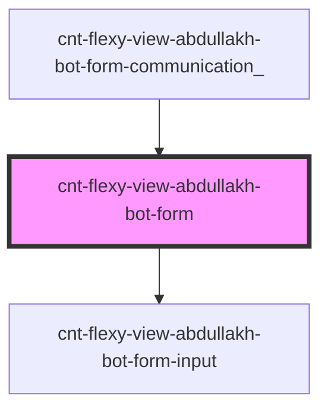

# s-abdullakh-form

<!-- Auto Generated Below -->

## Properties

| Property | Attribute | Description                           | Type               | Default     |
| -------- | --------- | ------------------------------------- | ------------------ | ----------- |
| `arr`    | --        | данные из массива для компонента Form | `AbdullakhBotForm` | `undefined` |

## Dependencies

### Used by

 - [cnt-flexy-view-abdullakh-bot-form-communication_](../../..)

### Depends on

- [cnt-flexy-view-abdullakh-bot-form-input](./res/view/cnt-flexy-view-abdullakh-bot-form-input)

### Graph

----------------------------------------------

*Built with [StencilJS](https://stenciljs.com/)*
