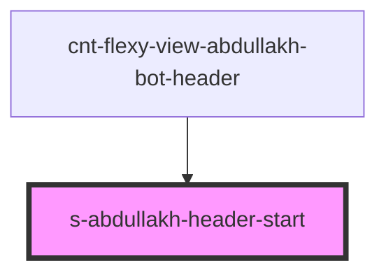

# s-abdullakh-header-start

<!-- Auto Generated Below -->

## Properties

| Property | Attribute | Description       | Type  | Default     |
| -------- | --------- | ----------------- | ----- | ----------- |
| `logo`   | `logo`    | объект с url logo | `any` | `undefined` |

## Events

| Event           | Description                                    | Type               |
| --------------- | ---------------------------------------------- | ------------------ |
| `clickOnHeader` | клик по элементу HeaderStart компонента header | `CustomEvent<any>` |

## Dependencies

### Used by

 - [cnt-flexy-view-abdullakh-bot-header](../../..)

### Graph

----------------------------------------------

*Built with [StencilJS](https://stenciljs.com/)*
