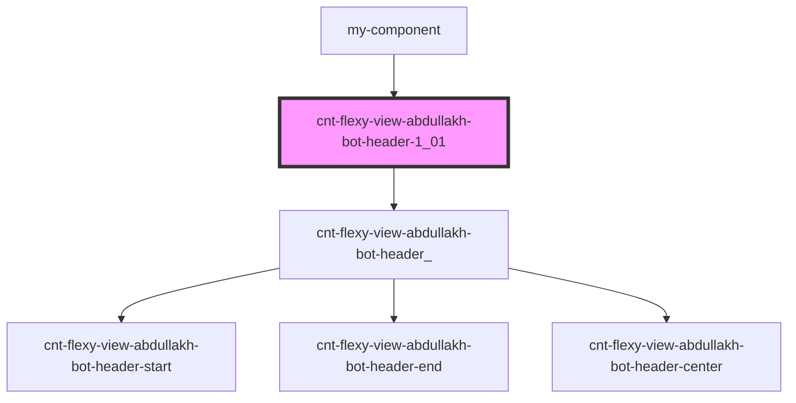

# cnt-flexy-view-bot-abdullakh-header-1_0_0

<!-- Auto Generated Below -->

## Properties

| Property       | Attribute        | Description                                                                | Type     | Default     |
| -------------- | ---------------- | -------------------------------------------------------------------------- | -------- | ----------- |
| `categories`   | `categories`     | объект с массивом меню и string для подкомпонентов header-start header-end | `any`    | `undefined` |
| `pathToAssets` | `path-to-assets` | префикс путь к картинкам                                                   | `string` | `undefined` |

## Dependencies

### Used by

 - [my-component](../my-component)

### Depends on

- [cnt-flexy-view-abdullakh-bot-header_](./res/view/cnt-flexy-view-abdullakh-bot-header_)

### Graph

----------------------------------------------

*Built with [StencilJS](https://stenciljs.com/)*
