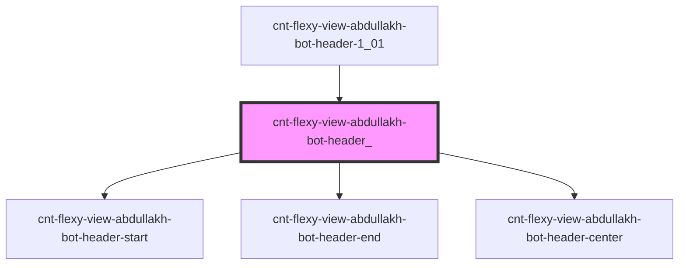

# s-abdullakh-header

<!-- Auto Generated Below -->

## Properties

| Property     | Attribute | Description                                                                | Type                                        | Default     |
| ------------ | --------- | -------------------------------------------------------------------------- | ------------------------------------------- | ----------- |
| `categories` | --        | объект с массивом меню и string для подкомпонентов header-start header-end | `CntFlexyViewCategoryForOwnerItemInterface` | `undefined` |

## Events

| Event           | Description                         | Type               |
| --------------- | ----------------------------------- | ------------------ |
| `clickOnHeader` | клик по элементам компонента header | `CustomEvent<any>` |

## Dependencies

### Used by

 - [cnt-flexy-view-abdullakh-bot-header-1_01](../../..)

### Depends on

- [cnt-flexy-view-abdullakh-bot-header-start](./res/view/cnt-flexy-view-abdullakh-bot-header-start)
- [cnt-flexy-view-abdullakh-bot-header-end](./res/view/cnt-flexy-view-abdullakh-bot-header-end)
- [cnt-flexy-view-abdullakh-bot-header-center](./res/view/cnt-flexy-view-abdullakh-bot-header-center)

### Graph

----------------------------------------------

*Built with [StencilJS](https://stenciljs.com/)*
