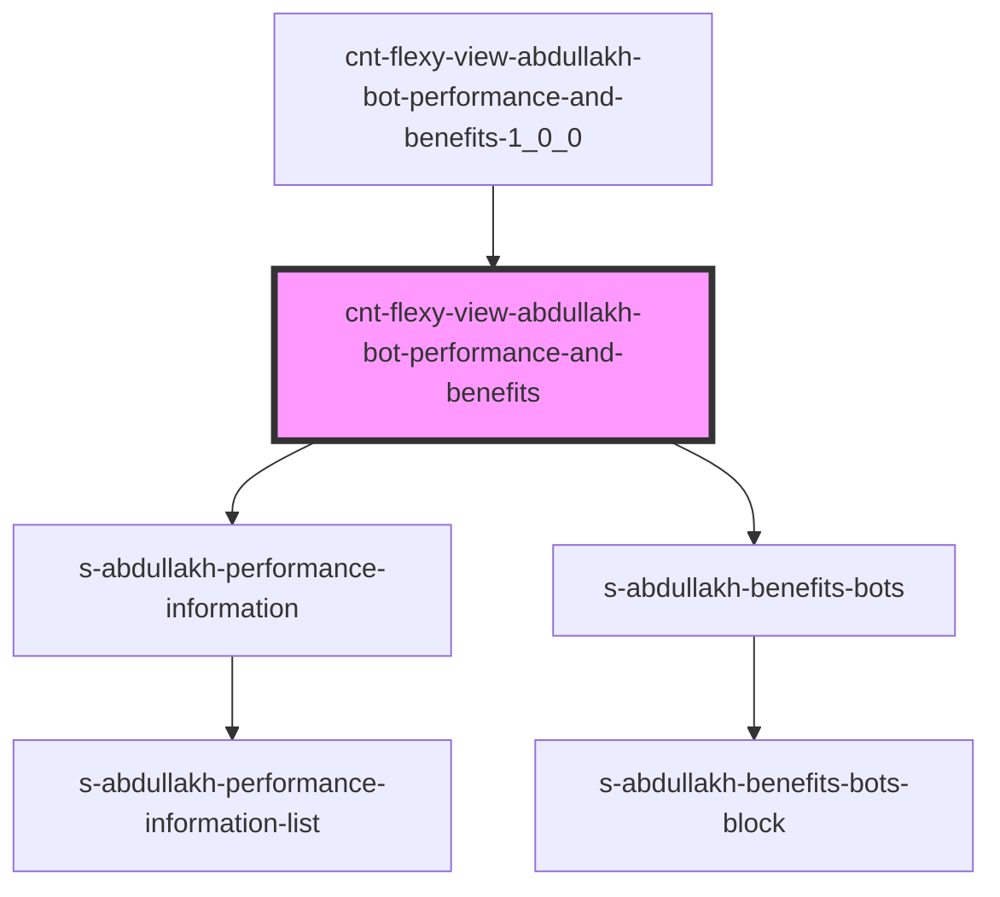

# s-abdullakh-performance-and-benefits

<!-- Auto Generated Below -->

## Properties

| Property  | Attribute | Description                                                         | Type  | Default     |
| --------- | --------- | ------------------------------------------------------------------- | ----- | ----------- |
| `payload` | `payload` | объект с массивами компонентов PerformanceInformation, BenefitsBots | `any` | `undefined` |

## Events

| Event                           | Description                                         | Type               |
| ------------------------------- | --------------------------------------------------- | ------------------ |
| `clickOnPerformanceAndBenefits` | клик по элементам компонента PerformanceAndBenefits | `CustomEvent<any>` |
| `openForm`                      | открытие формы связи                                | `CustomEvent<any>` |

## Dependencies

### Used by

 - [cnt-flexy-view-abdullakh-bot-performance-and-benefits-1_0_0](../../..)

### Depends on

- [s-abdullakh-performance-information](./res/view/s-abdullakh-performance-information)
- [s-abdullakh-benefits-bots](./res/view/s-abdullakh-benefits-bots)

### Graph

----------------------------------------------

*Built with [StencilJS](https://stenciljs.com/)*
