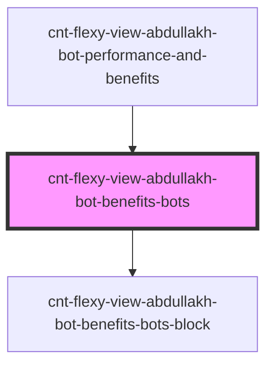

# s-abdullakh-benefits-bots

<!-- Auto Generated Below -->

## Properties

| Property       | Attribute | Description                              | Type                      | Default     |
| -------------- | --------- | ---------------------------------------- | ------------------------- | ----------- |
| `BenefitsBots` | --        | объект с массивом и данными BenefitsBots | `SSAbdullakhBenefitsBots` | `undefined` |

## Events

| Event                 | Description                               | Type               |
| --------------------- | ----------------------------------------- | ------------------ |
| `clickOnBenefitsBots` | клик по элементам компонента BenefitsBots | `CustomEvent<any>` |

## Dependencies

### Used by

 - [cnt-flexy-view-abdullakh-bot-performance-and-benefits](../../..)

### Depends on

- [cnt-flexy-view-abdullakh-bot-benefits-bots-block](./res/view/cnt-flexy-view-abdullakh-bot-benefits-bots-block)

### Graph

----------------------------------------------

*Built with [StencilJS](https://stenciljs.com/)*
