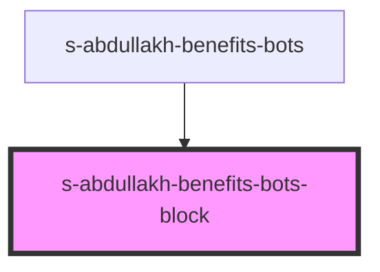

# s-abdullakh-benefits-bots-block

<!-- Auto Generated Below -->

## Properties

| Property | Attribute | Description                                                | Type  | Default     |
| -------- | --------- | ---------------------------------------------------------- | ----- | ----------- |
| `arr`    | `arr`     | данные переданные методом map компоненту BenefitsBotsBlock | `any` | `undefined` |

## Events

| Event                 | Description                               | Type               |
| --------------------- | ----------------------------------------- | ------------------ |
| `clickOnBenefitsBots` | клик по элементам компонента BenefitsBots | `CustomEvent<any>` |

## Dependencies

### Used by

 - [s-abdullakh-benefits-bots](../../..)

### Graph

----------------------------------------------

*Built with [StencilJS](https://stenciljs.com/)*
