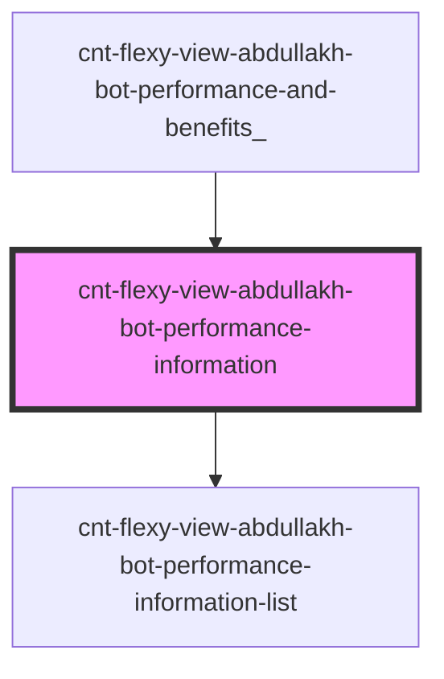

# s-abdullakh-performance-information

<!-- Auto Generated Below -->

## Properties

| Property                 | Attribute | Description                                        | Type                                | Default     |
| ------------------------ | --------- | -------------------------------------------------- | ----------------------------------- | ----------- |
| `PerformanceInformation` | --        | массив для вывода элементов PerformanceInformation | `SSAbdullakhPerformanceInformation` | `undefined` |

## Events

| Event                           | Description                                         | Type               |
| ------------------------------- | --------------------------------------------------- | ------------------ |
| `clickOnPerformanceInformation` | клик по элементам компонента PerformanceInformation | `CustomEvent<any>` |
| `openForm`                      | Вызов модального окна формы                         | `CustomEvent<any>` |

## Dependencies

### Used by

 - [cnt-flexy-view-abdullakh-bot-performance-and-benefits_](../../..)

### Depends on

- [cnt-flexy-view-abdullakh-bot-performance-information-list](./res/view/cnt-flexy-view-abdullakh-bot-performance-information-list)

### Graph

----------------------------------------------

*Built with [StencilJS](https://stenciljs.com/)*
