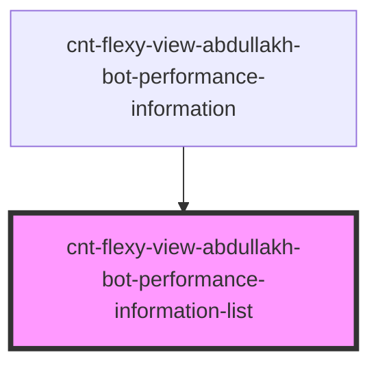

# s-abdullakh-performance-information-list

<!-- Auto Generated Below -->

## Properties

| Property                 | Attribute                 | Description                                            | Type     | Default     |
| ------------------------ | ------------------------- | ------------------------------------------------------ | -------- | ----------- |
| `PerformanceInformation` | `performance-information` | объект с массивом и данными PerformanceInformationList | `any`    | `undefined` |
| `endText`                | `end-text`                | объект с массивом и данными PerformanceInformationList | `string` | `undefined` |

## Events

| Event                           | Description                                                                                  | Type               |
| ------------------------------- | -------------------------------------------------------------------------------------------- | ------------------ |
| `clickOnPerformanceInformation` | клик по элементам компонента PerformanceInformation подкомпонента PerformanceInformationList | `CustomEvent<any>` |

## Dependencies

### Used by

 - [cnt-flexy-view-abdullakh-bot-performance-information](../../..)

### Graph

----------------------------------------------

*Built with [StencilJS](https://stenciljs.com/)*
