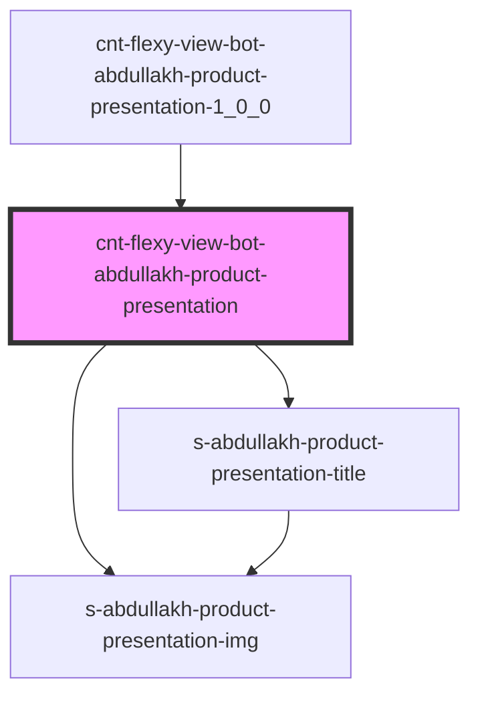

# s-abdullakh-product-presentation

<!-- Auto Generated Below -->

## Properties

| Property  | Attribute | Description                                          | Type                             | Default     |
| --------- | --------- | ---------------------------------------------------- | -------------------------------- | ----------- |
| `payload` | --        | массив для вывода элементов ProductPresentationTitle | `SSAbdullakhProductPresentation` | `undefined` |

## Events

| Event                        | Description                                      | Type               |
| ---------------------------- | ------------------------------------------------ | ------------------ |
| `clickOnProductPresentation` | клик по элементам компонента ProductPresentation | `CustomEvent<any>` |
| `openForm`                   | Вызов модального окна формы                      | `CustomEvent<any>` |

## Dependencies

### Used by

 - [cnt-flexy-view-bot-abdullakh-product-presentation-1_0_0](../../..)

### Depends on

- [s-abdullakh-product-presentation-img](./res/view/s-abdullakh-product-presentation-img)
- [s-abdullakh-product-presentation-title](./res/view/s-abdullakh-product-presentation-title)

### Graph

----------------------------------------------

*Built with [StencilJS](https://stenciljs.com/)*
