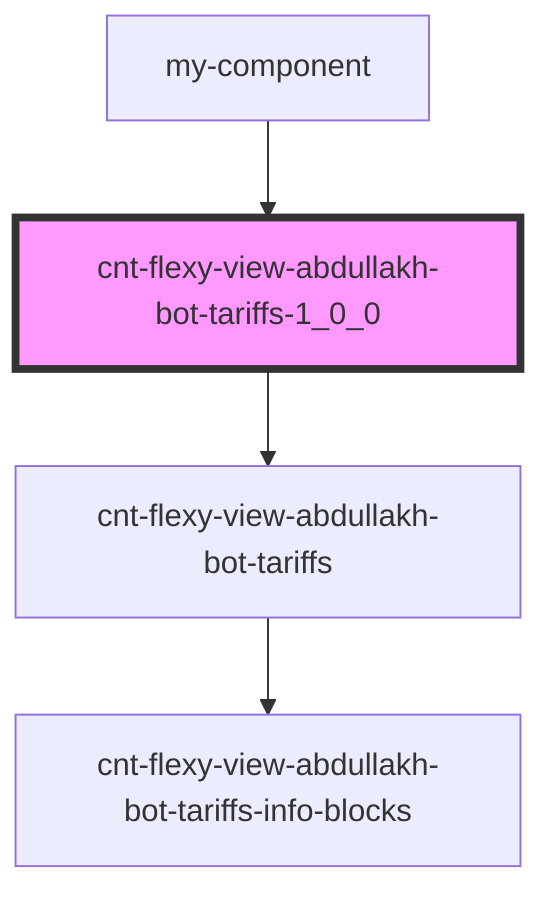

# cnt-flexy-view-abdullakh-bot-tariffs-1_0_0

<!-- Auto Generated Below -->

## Properties

| Property       | Attribute        | Description               | Type     | Default     |
| -------------- | ---------------- | ------------------------- | -------- | ----------- |
| `pathToAssets` | `path-to-assets` |                           | `string` | `undefined` |
| `payload`      | `payload`        | данные компонента Tariffs | `any`    | `undefined` |

## Events

| Event      | Description                 | Type               |
| ---------- | --------------------------- | ------------------ |
| `openForm` | Вызов модального окна формы | `CustomEvent<any>` |

## Dependencies

### Used by

 - [my-component](../my-component)

### Depends on

- [cnt-flexy-view-abdullakh-bot-tariffs](./res/view/cnt-flexy-view-abdullakh-bot-tariffs)

### Graph

----------------------------------------------

*Built with [StencilJS](https://stenciljs.com/)*
