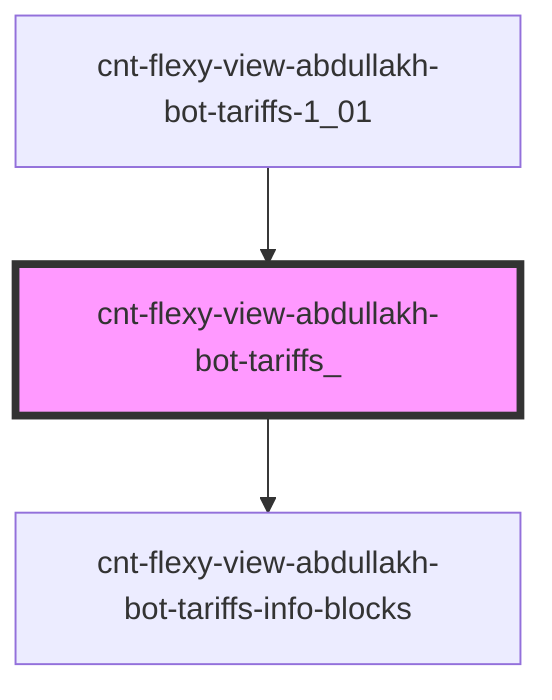

# s-abdullakh-tariffs

<!-- Auto Generated Below -->

## Properties

| Property  | Attribute | Description               | Type  | Default     |
| --------- | --------- | ------------------------- | ----- | ----------- |
| `payload` | `payload` | данные компонента Tariffs | `any` | `undefined` |

## Events

| Event            | Description                          | Type               |
| ---------------- | ------------------------------------ | ------------------ |
| `clickOnTariffs` | клик по элементам компонента Tariffs | `CustomEvent<any>` |
| `openForm`       | Вызов модального окна формы          | `CustomEvent<any>` |

## Dependencies

### Used by

 - [cnt-flexy-view-abdullakh-bot-tariffs-1_01](../../..)

### Depends on

- [cnt-flexy-view-abdullakh-bot-tariffs-info-blocks](./res/view/cnt-flexy-view-abdullakh-bot-tariffs-info-blocks)

### Graph

----------------------------------------------

*Built with [StencilJS](https://stenciljs.com/)*
