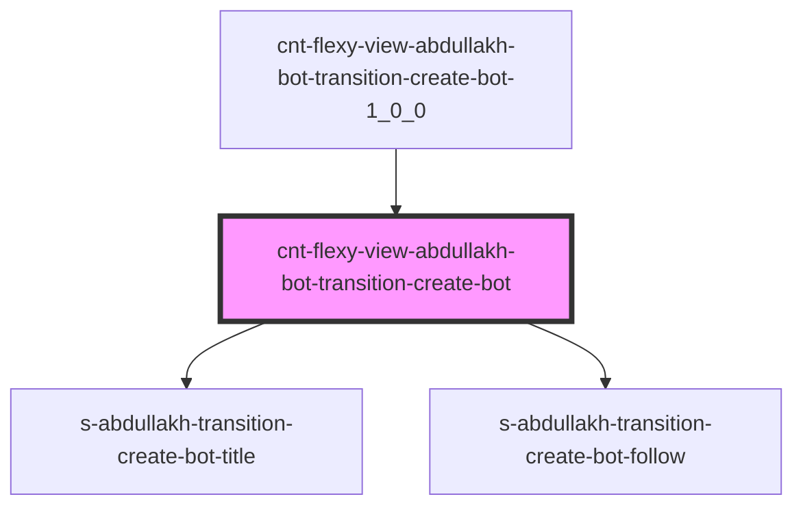

# s-abdullakh-transition-create-bot

<!-- Auto Generated Below -->

## Properties

| Property  | Attribute | Description                                     | Type                             | Default     |
| --------- | --------- | ----------------------------------------------- | -------------------------------- | ----------- |
| `payload` | --        | массив для вывода элементов TransitionCreateBot | `SSAbdullakhTransitionCreateBot` | `undefined` |

## Events

| Event                        | Description                                      | Type               |
| ---------------------------- | ------------------------------------------------ | ------------------ |
| `clickOnTransitionCreateBot` | клик по элементам компонента TransitionCreateBot | `CustomEvent<any>` |
| `openForm`                   | Вызов модального окна формы                      | `CustomEvent<any>` |

## Dependencies

### Used by

 - [cnt-flexy-view-abdullakh-bot-transition-create-bot-1_0_0](../../..)

### Depends on

- [s-abdullakh-transition-create-bot-title](./res/view/s-abdullakh-transition-create-bot-title)
- [s-abdullakh-transition-create-bot-follow](./res/view/s-abdullakh-transition-create-bot-follow)

### Graph

----------------------------------------------

*Built with [StencilJS](https://stenciljs.com/)*
