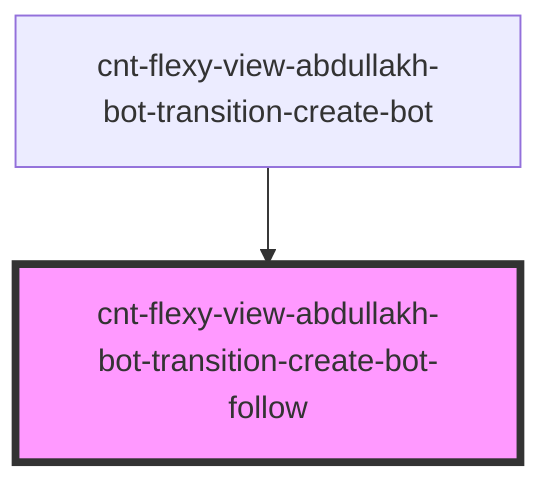

# s-abdullakh-transition-create-bot-follow

<!-- Auto Generated Below -->

## Properties

| Property | Attribute | Description                                                                                        | Type  | Default     |
| -------- | --------- | -------------------------------------------------------------------------------------------------- | ----- | ----------- |
| `arr`    | `arr`     | массив для вывода элементов подкомпонента TransitionCreateBotFollow компонента TransitionCreateBot | `any` | `undefined` |

## Events

| Event                        | Description                                      | Type               |
| ---------------------------- | ------------------------------------------------ | ------------------ |
| `clickOnTransitionCreateBot` | клик по элементам компонента TransitionCreateBot | `CustomEvent<any>` |

## Dependencies

### Used by

 - [cnt-flexy-view-abdullakh-bot-transition-create-bot](../../..)

### Graph

----------------------------------------------

*Built with [StencilJS](https://stenciljs.com/)*
