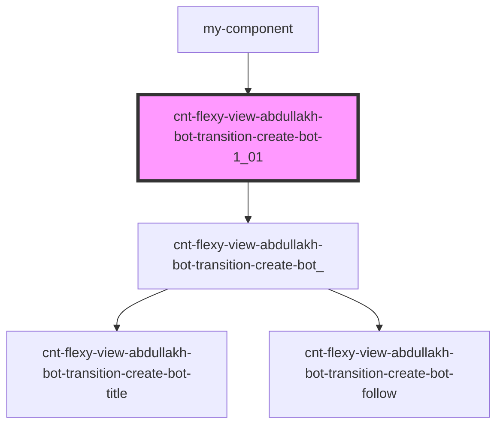

# cnt-flexy-view-abdullakh-bot-transition-create-bot-1_0_0

<!-- Auto Generated Below -->

## Properties

| Property       | Attribute        | Description                                     | Type     | Default     |
| -------------- | ---------------- | ----------------------------------------------- | -------- | ----------- |
| `pathToAssets` | `path-to-assets` | префикс путь к картинкам                        | `string` | `undefined` |
| `payload`      | `payload`        | массив для вывода элементов TransitionCreateBot | `any`    | `undefined` |

## Events

| Event      | Description                 | Type               |
| ---------- | --------------------------- | ------------------ |
| `openForm` | Вызов модального окна формы | `CustomEvent<any>` |

## Dependencies

### Used by

 - [my-component](../my-component)

### Depends on

- [cnt-flexy-view-abdullakh-bot-transition-create-bot_](./res/view/cnt-flexy-view-abdullakh-bot-transition-create-bot_)

### Graph

----------------------------------------------

*Built with [StencilJS](https://stenciljs.com/)*
