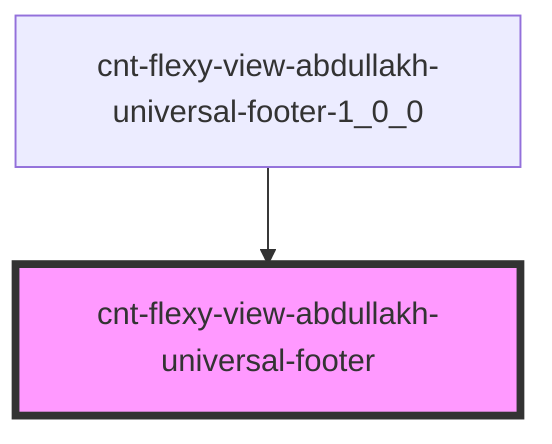

# cnt-flexy-view-abdullakh-universal-footer

<!-- Auto Generated Below -->

## Properties

| Property      | Attribute      | Description | Type  | Default     |
| ------------- | -------------- | ----------- | ----- | ----------- |
| `footerIcons` | `footer-icons` |             | `any` | `undefined` |

## Dependencies

### Used by

 - [cnt-flexy-view-abdullakh-universal-footer-1_0_0](../../..)

### Graph

----------------------------------------------

*Built with [StencilJS](https://stenciljs.com/)*
