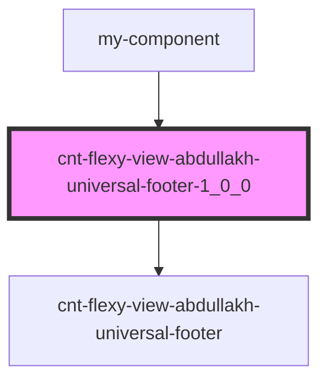

# cnt-flexy-view-abdullakh-universal-footer-1_0_0

<!-- Auto Generated Below -->

## Properties

| Property     | Attribute    | Description | Type  | Default     |
| ------------ | ------------ | ----------- | ----- | ----------- |
| `categories` | `categories` |             | `any` | `undefined` |

## Dependencies

### Used by

 - [my-component](../my-component)

### Depends on

- [cnt-flexy-view-abdullakh-universal-footer](res/view/cnt-flexy-view-abdullakh-universal-footer_)

### Graph

----------------------------------------------

*Built with [StencilJS](https://stenciljs.com/)*
