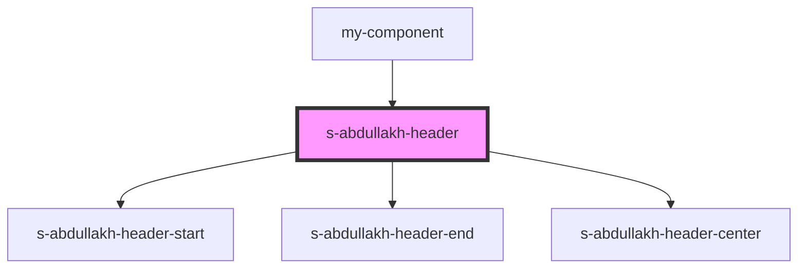

# s-abdullakh-header

<!-- Auto Generated Below -->

## Properties

| Property | Attribute | Description                                                                | Type              | Default     |
| -------- | --------- | -------------------------------------------------------------------------- | ----------------- | ----------- |
| `header` | --        | объект с массивом меню и string для подкомпонентов header-start header-end | `AbdullakhHeader` | `undefined` |

## Events

| Event           | Description                         | Type               |
| --------------- | ----------------------------------- | ------------------ |
| `clickOnHeader` | клик по элементам компонента header | `CustomEvent<any>` |

## Dependencies

### Used by

 - [my-component](../../../../my-component)

### Depends on

- [s-abdullakh-header-start](res/view/s-abdullakh-header-start)
- [s-abdullakh-header-end](res/view/s-abdullakh-header-end)
- [s-abdullakh-header-center](res/view/s-abdullakh-header-center)

### Graph

----------------------------------------------

*Built with [StencilJS](https://stenciljs.com/)*
