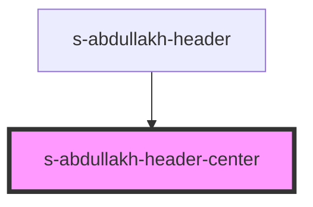

# s-abdullakh-header-center

<!-- Auto Generated Below -->

## Properties

| Property | Attribute | Description                           | Type                    | Default     |
| -------- | --------- | ------------------------------------- | ----------------------- | ----------- |
| `arr`    | --        | объект с данными и для элементов меню | `AbdullakhHeaderCenter` | `undefined` |

## Events

| Event           | Description                                            | Type               |
| --------------- | ------------------------------------------------------ | ------------------ |
| `clickOnHeader` | клик по элементу HeaderCenter (меню) компонента header | `CustomEvent<any>` |

## Dependencies

### Used by

 - [s-abdullakh-header](../../../../../../../../../../../..)

### Graph

----------------------------------------------

*Built with [StencilJS](https://stenciljs.com/)*
