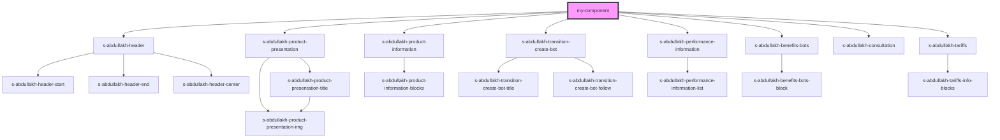

# my-component

<!-- Auto Generated Below -->

## Dependencies

### Depends on

- [s-abdullakh-header](../s-abdullakh-header)
- [s-abdullakh-product-presentation](../s-abdullakh-product-presentation)
- [s-abdullakh-product-information](../s-abdullakh-product-information)
- [s-abdullakh-transition-create-bot](../s-abdullakh-transition-create-bot)
- [s-abdullakh-performance-information](../s-abdullakh-performance-information)
- [s-abdullakh-benefits-bots](../s-abdullakh-benefits-bots)
- [s-abdullakh-consultation](../s-abdullakh-consultation)
- [s-abdullakh-tariffs](../s-abdullakh-tariffs)

### Graph

----------------------------------------------

*Built with [StencilJS](https://stenciljs.com/)*
