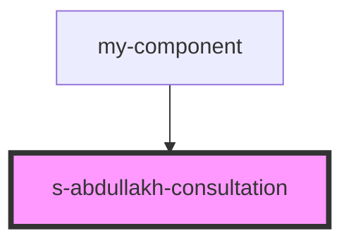

# s-abdullakh-consultation

<!-- Auto Generated Below -->

## Properties

| Property       | Attribute | Description                    | Type                      | Default     |
| -------------- | --------- | ------------------------------ | ------------------------- | ----------- |
| `Consultation` | --        | данные компонента Consultation | `SSAbdullakhConsultation` | `undefined` |

## Events

| Event                 | Description                               | Type               |
| --------------------- | ----------------------------------------- | ------------------ |
| `clickOnConsultation` | клик по элементам компонента Consultation | `CustomEvent<any>` |
| `openForm`            | Вызов модального окна формы               | `CustomEvent<any>` |

## Dependencies

### Used by

 - [my-component](../my-component)

### Graph

----------------------------------------------

*Built with [StencilJS](https://stenciljs.com/)*
