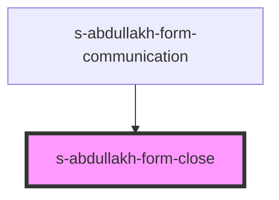

# s-abdullakh-form-close

<!-- Auto Generated Below -->

## Events

| Event       | Description                    | Type               |
| ----------- | ------------------------------ | ------------------ |
| `closeForm` | Закрытие модального окна формы | `CustomEvent<any>` |

## Dependencies

### Used by

 - [s-abdullakh-form-communication](../../..)

### Graph

----------------------------------------------

*Built with [StencilJS](https://stenciljs.com/)*
