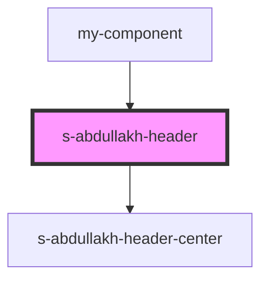

# s-abdullakh-header

<!-- Auto Generated Below -->

## Properties

| Property | Attribute | Description | Type  | Default     |
| -------- | --------- | ----------- | ----- | ----------- |
| `header` | `header`  | массив меню | `any` | `undefined` |

## Dependencies

### Used by

 - [my-component](../my-component)

### Depends on

- [s-abdullakh-header-center](res/view/s-abdullakh-header-center)

### Graph

----------------------------------------------

*Built with [StencilJS](https://stenciljs.com/)*
