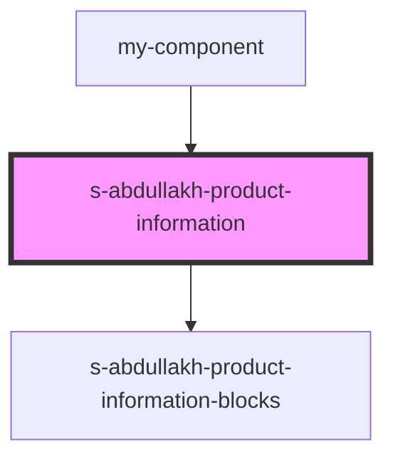

# s-abdullakh-product-information

<!-- Auto Generated Below -->

## Properties

| Property             | Attribute | Description                                         | Type                            | Default     |
| -------------------- | --------- | --------------------------------------------------- | ------------------------------- | ----------- |
| `ProductInformation` | --        | данные из объекта для компонента ProductInformation | `SSAbdullakhProductInformation` | `undefined` |

## Events

| Event                       | Description                                     | Type               |
| --------------------------- | ----------------------------------------------- | ------------------ |
| `clickOnProductInformation` | клик по элементам компонента ProductInformation | `CustomEvent<any>` |
| `openForm`                  | Вызов модального окна формы                     | `CustomEvent<any>` |

## Dependencies

### Used by

 - [my-component](../my-component)

### Depends on

- [s-abdullakh-product-information-blocks](res/view/s-abdullakh-product-information-blocks)

### Graph

----------------------------------------------

*Built with [StencilJS](https://stenciljs.com/)*
