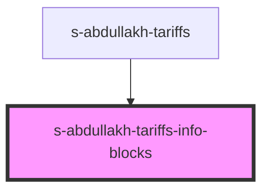

# s-abdullakh-tariffs-info-blocks

<!-- Auto Generated Below -->

## Properties

| Property | Attribute | Description                                            | Type  | Default     |
| -------- | --------- | ------------------------------------------------------ | ----- | ----------- |
| `arr`    | `arr`     | данные переданные методом map компоненту TariffsBlocks | `any` | `undefined` |

## Events

| Event            | Description                          | Type               |
| ---------------- | ------------------------------------ | ------------------ |
| `clickOnTariffs` | клик по элементам компонента Tariffs | `CustomEvent<any>` |
| `openForm`       | Вызов модального окна формы          | `CustomEvent<any>` |

## Dependencies

### Used by

 - [s-abdullakh-tariffs](../../..)

### Graph

----------------------------------------------

*Built with [StencilJS](https://stenciljs.com/)*
